# Autonomous Edge-AI Pothole Detection & Automated Filling System

[](https://www.python.org/)
[](https://pytorch.org/)
[](https://github.com/ultralytics/ultralytics)
[](https://www.raspberrypi.com/)
[](https://cloud.google.com/storage)
[](https://opencv.org/)

An end-to-end Edge-AI robotics system for real-time pothole detection, multi-frame object tracking, 3D depth mapping, volume estimation, density-based spatial clustering (DBSCAN), automated servo-controlled repair dispensing, GPS geotagging, and cloud telemetry.

---

## Key Features & System Capabilities

1. **YOLOv8 Edge Object Detection & Tracking**
   - High-speed real-time detection of road defects across static images, pre-recorded video feeds, and live camera streams.
   - Multi-frame centroid-distance tracking algorithm with a sliding volume buffer (`deque`) to maintain temporal consistency and prevent duplicate counts.

2. **Monocular 3D Depth Map & Spatial Geometry**
   - Monocular relative depth inference via Intel **MiDaS** (and mobile-efficient **FastDepth** alternative).
   - Pixel-to-metric geometric mapping using camera focal parameters ($f_x, f_y$) to project 2D bounding boxes into real-world physical width ($X_m$), length ($Y_m$), and depth ($D_{real}$).

3. **Real-World Volumetric Calculation & Material Demand**
   - Calculates exact pothole fill volume in liters and cubic meters ($m^3$) using depth map integration across detected boundary pixels.
   - Computes total tar/asphalt mix required for localized repair operations to prevent material waste.

4. **DBSCAN Density-Based Spatial Clustering**
   - Groups adjacent or closely-spaced potholes using Density-Based Spatial Clustering of Applications with Noise (DBSCAN).
   - Encapsulates cluster groups within macro bounding boxes and evaluates aggregated cluster repair volume for large-scale section maintenance.

5. **Automated Hardware Dispensing Mechanism**
   - Onboard Raspberry Pi 3 Model B interfaced with a PWM Servo Motor-driven hopper gate.
   - Automatically actuates dispensing nozzle to deliver calculated filler material volume directly into identified road surface defects.

6. **GPS Geotagging & Edge-to-Cloud Telemetry**
   - Automatic coordinate retrieval via GPS receiver / IP-geolocation API.
   - Non-blocking asynchronous multi-threaded upload of annotated detection frames, cropped defect patches, and structured JSON logs to **Google Cloud Storage (GCS)**.

7. **Resurfacing Recommendation & Cost Audit Engine**
   - Evaluates repair cost per pothole based on material volume.
   - Analyzes defect density per road section to automatically issue **Resurfacing Recommendations** when damage exceeds critical severity thresholds.

---

## Hardware Prototype & System Architecture

### Hardware Prototype
The physical system integrates an edge compute board (Raspberry Pi 3B), high-resolution vision sensor, GPS module, and a servo-actuated filler material hopper mounted on a mobile platform.

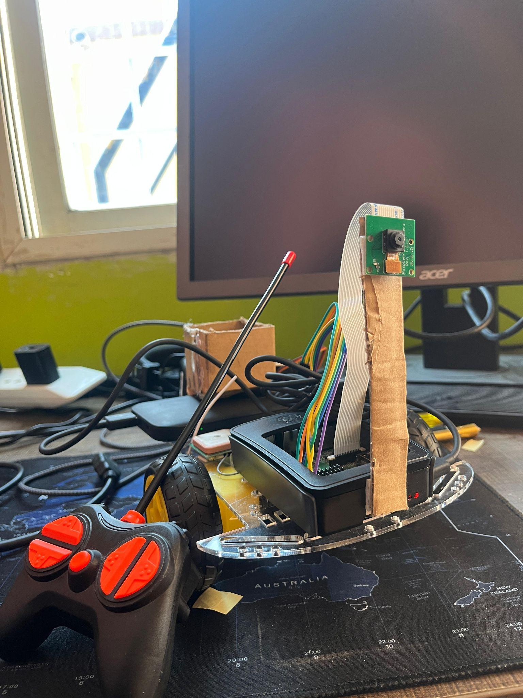

### System Architecture & Flow

| Hardware & Block Diagram | System Flow Diagram |
| :---: | :---: |
| 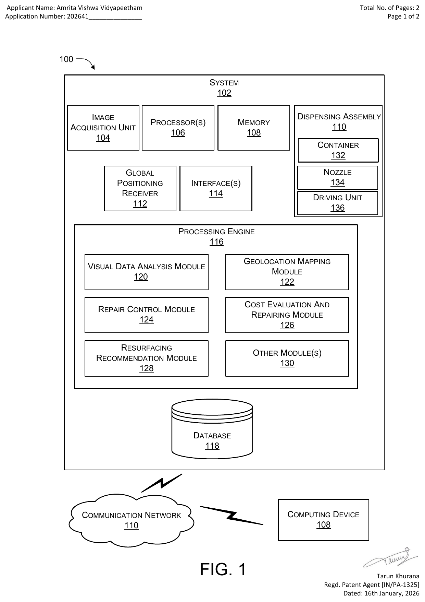 | 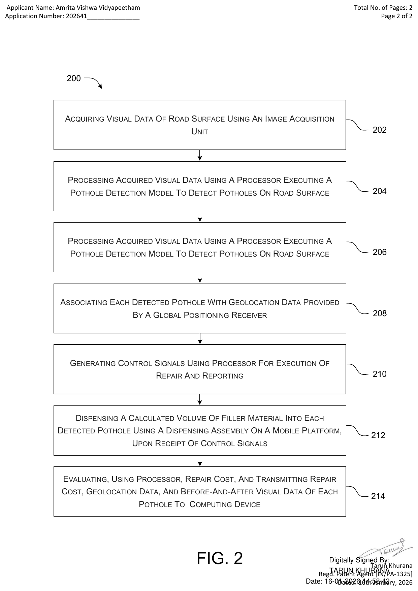 |

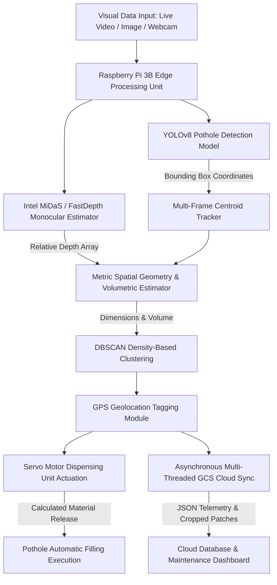

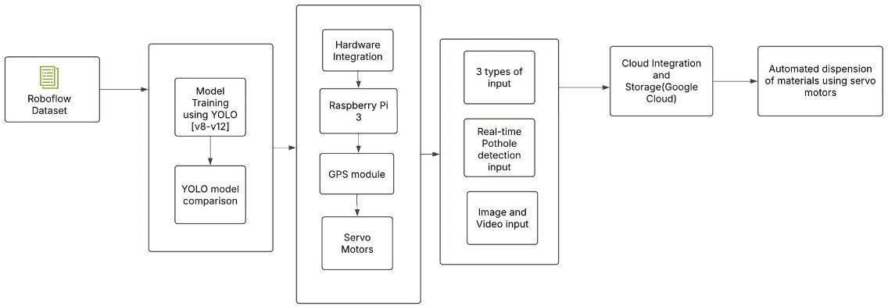

---

## Deep Learning Model Benchmark & Performance

The detection pipeline was evaluated across multiple YOLO architectures (YOLOv3 through YOLOv12). YOLOv8 Nano (`best.pt`) was selected for edge deployment on Raspberry Pi hardware due to its optimal trade-off between mean Average Precision (mAP) and real-time inference speed.

| Model Version | Precision | Recall | mAP@50 | Latency (ms) | Real-Time Suitability |
| :--- | :---: | :---: | :---: | :---: | :---: |
| **YOLOv8 (Custom Trained)** | **0.952** | **0.968** | **0.958** | **18.4** | **Optimal (Edge Ready)** |
| YOLOv7 | 0.931 | 0.942 | 0.940 | 28.6 | Moderate |
| YOLOv5m | 0.895 | 0.912 | 0.918 | 24.1 | Moderate |
| YOLOv3 | 0.812 | 0.834 | 0.825 | 45.2 | Slow |

### Detection & Model Comparison Visualizations

| YOLO Model Metrics | Version Performance Comparison |
| :---: | :---: |
| 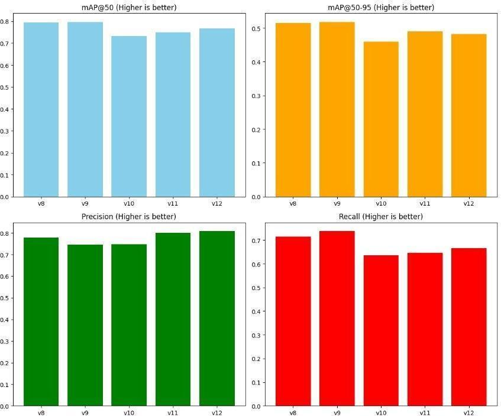 | 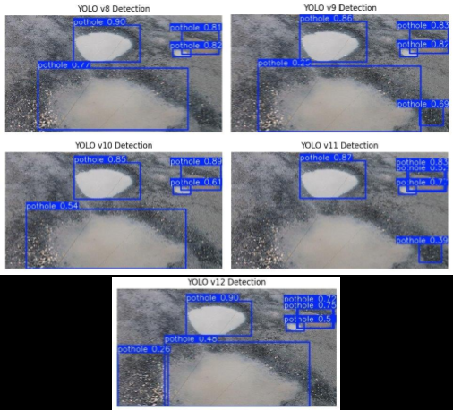 |

| Real-World Road Detection | Real-Time Raspberry Pi 3 Detection |
| :---: | :---: |
| 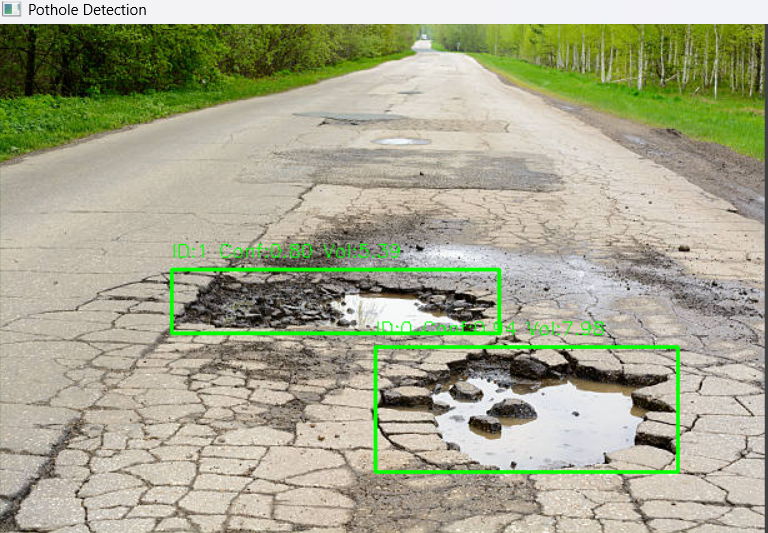 | 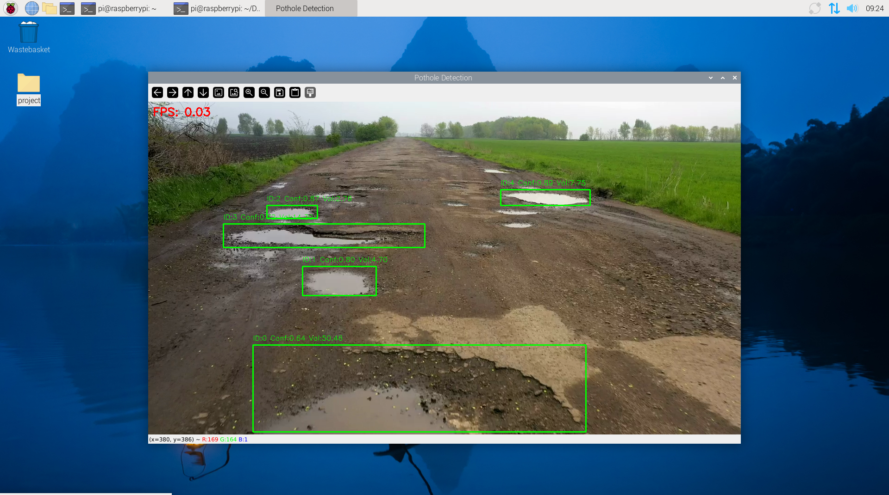 |

---

## Mathematical Formulations

### 1. Focal Geometry & Spatial Projection
Given a bounding box with pixel width $W_{px}$ and pixel height $H_{px}$, the real-world metric width ($X_m$) and length ($Y_m$) at estimated distance $Z$ are calculated using intrinsic focal lengths $(f_x, f_y)$:

$$X_m = \frac{W_{px} \cdot Z}{f_x}$$

$$Y_m = \frac{H_{px} \cdot Z}{f_y}$$

Focal length calibration based on mounting height $H_{cam}$, inclination angle $\theta$, and pixel-to-meter ratio $r$:

$$f_y = \frac{H_{cam} / r}{\tan(\theta)}, \quad f_x = f_y$$

### 2. Relative Depth Map to Metric Depth Scaling
Intel MiDaS yields inverse relative depth values $d_{rel}$. Metric distance $Z$ and real-world pothole depth $D_{real}$ are calculated via scaling constants ($\lambda_{scale}, \alpha$):

$$Z = \frac{\lambda_{scale}}{\bar{d}_{rel}}$$

$$D_{real} = \bar{d}_{rel} \times \alpha$$

### 3. Volumetric & Material Demand Calculation
The cumulative volume of repair material required for a detected pothole defect is computed as:

$$\text{Volume } (m^3) = X_m \times Y_m \times D_{real}$$

$$\text{Volume } (\text{Liters}) = \text{Volume } (m^3) \times 1000$$

### 4. Density-Based Spatial Clustering (DBSCAN)
Pothole centers $C_i = (x_i, y_i)$ are clustered using neighborhood radius $\epsilon = 75\text{ px}$ and minimum sample count $MinPts = 2$:

$$N_\epsilon(C_i) = \{ C_j \in D \mid \text{dist}(C_i, C_j) \le \epsilon \}$$

Clusters are formed when $|N_\epsilon(C_i)| \ge MinPts$, generating unified bounding envelopes for group repairs.

| DBSCAN Spatial Clustering Output | Servo Actuation Calibration Run |
| :---: | :---: |
| 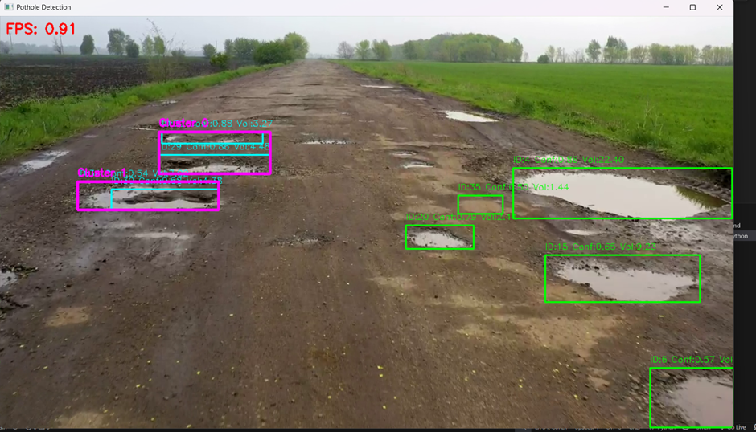 | 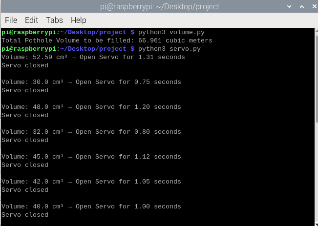 |

---

## Telemetry, Cloud Storage & Data Logs

When a defect is identified:
1. Cropped pothole images are saved locally to `pothole_images/pothole_{id}.jpg`.
2. Detection parameters, GPS coordinates, dimensions, volume, and cluster IDs are serialized to `data/detections.json`.
3. Background threads push image artifacts and metadata to Google Cloud Storage (`pothole_img_storage`).

| JSON Data Schema Screenshot | GCS Cloud Storage Bucket |
| :---: | :---: |
| 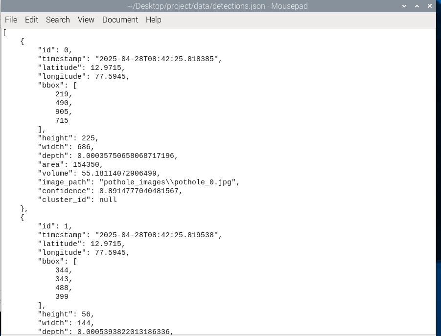 | 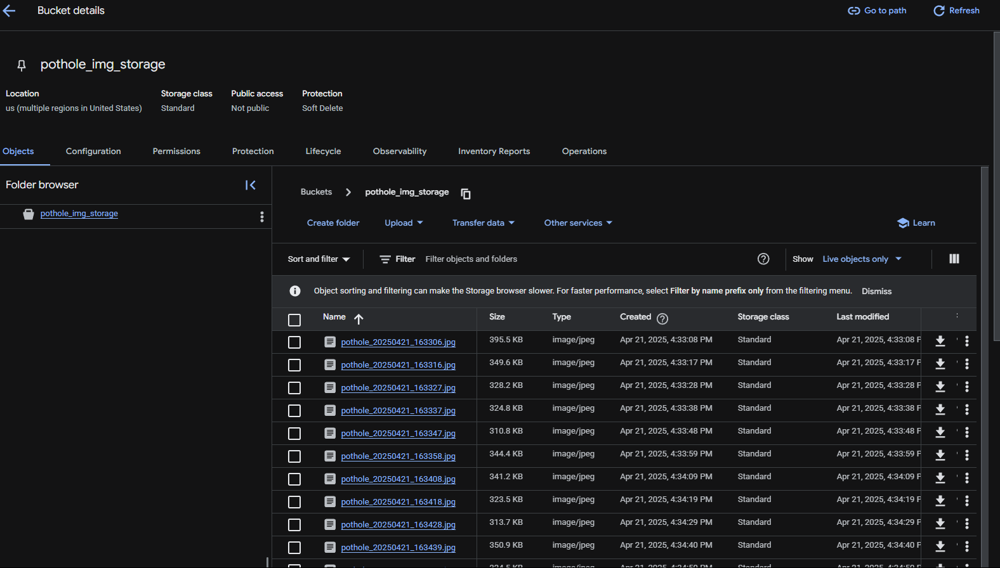 |

| Cropped Pothole Storage | Terminal Live Execution Logs |
| :---: | :---: |
| 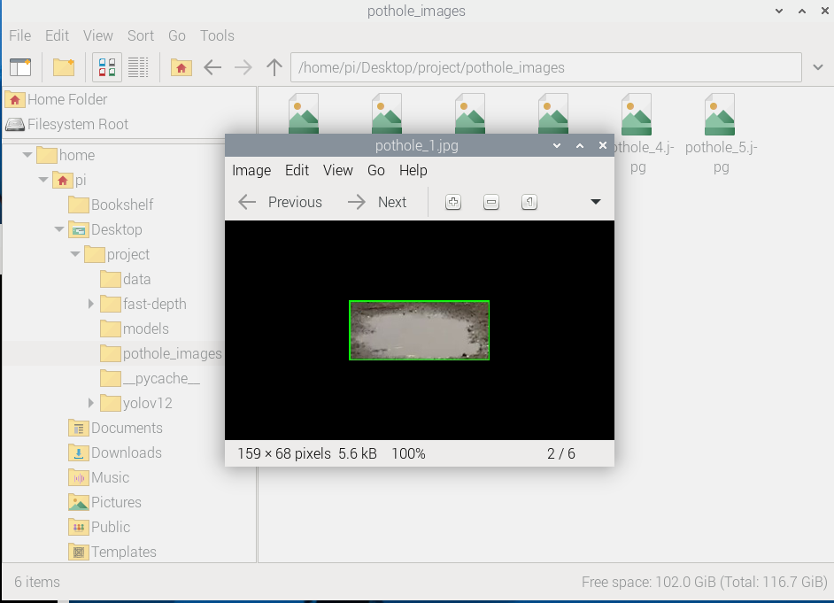 | 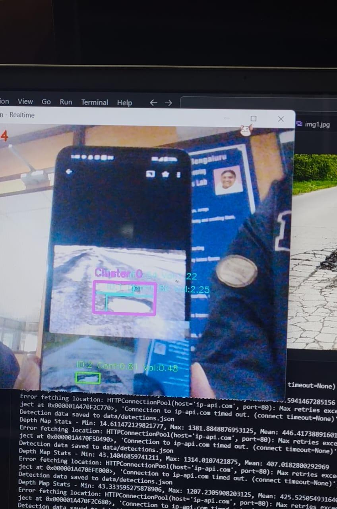 |

---

## Repository Directory Structure

```
Pothole-Detection-And-Automated-Repair/
├── data/
│   └── detections.json            # JSON database of logged detections, geotags, & volumes
├── models/
│   └── best.pt                    # Custom trained YOLOv8 PyTorch weights
├── sample_data/
│   ├── images/                    # Sample cropped & road test images
│   └── videos/                    # Sample road test videos (p1.mp4, pothole_video.mp4)
├── pothole_images/                # Runtime output directory for cropped pothole bounding boxes
├── docs/
│   ├── images/                    # System architecture & benchmark figures
│   ├── papers/
│   │   └── paper_text.txt         # Project report text
│   └── patents/
│       ├── patent_pub.txt         # Patent publication specifications
│       ├── complete_spec.txt      # Specification details
│       └── invention_disclosure.txt # Disclosure document
├── fast-depth/                    # Mobile-optimized FastDepth monocular estimation module
├── yolov12/                       # Ultralytics YOLOv12 research module repository
├── depth_estimator.py             # PyTorch MiDaS depth estimator wrapper class
├── pothole_detector.py            # Primary pipeline (YOLOv8 + MiDaS + Tracking + DBSCAN + JSON)
├── potholecloud.py                # Asynchronous GCS cloud storage uploader with IP geotagging
├── potholevideo.py                # Interactive CLI detection runner for image/video/webcam
├── road.py                        # Hough Line Transform road angle & focal length calculator
├── volume.py                      # Telemetry parser calculating cumulative tar material volume
├── requirements.txt               # Python package dependency list
├── .gitignore                     # Repository ignore rules
└── README.md                      # Project documentation
```

---

## Installation & Setup

### 1. Prerequisites
- Python 3.8 or higher
- PyTorch 1.10+ (with CUDA support if running on GPU, or CPU mode for Raspberry Pi)
- OpenCV (`opencv-python`)
- Google Cloud Storage SDK (`google-cloud-storage`)

### 2. Environment Setup
Clone the repository and install required Python packages:

```bash
git clone https://github.com/praneethreddy/Pothole-Detection-And-Automated-Repair.git
cd Pothole-Detection-And-Automated-Repair
pip install -r requirements.txt
```

### 3. Google Cloud Credentials (Optional for Cloud Sync)
To enable cloud synchronization with Google Cloud Storage:
1. Place your GCP service account key file `pothole.json` in the root directory.
2. Set the environment variable:
   ```bash
   export GOOGLE_APPLICATION_CREDENTIALS="pothole.json"
   ```

---

## Usage Guide

### 1. Primary Pothole Detection Pipeline (`pothole_detector.py`)

Run detection, 3D depth estimation, multi-frame tracking, DBSCAN clustering, and volumetric logging:

- **Run on Video Input**:
  ```bash
  python pothole_detector.py --type video --path sample_data/videos/pothole_video.mp4
  ```

- **Run on Static Image**:
  ```bash
  python pothole_detector.py --type image --path sample_data/images/pothole_0.jpg
  ```

- **Run on Live Webcam Stream**:
  ```bash
  python pothole_detector.py --type realtime
  ```

### 2. Interactive Video & Webcam Pipeline (`potholevideo.py`)
Run an interactive CLI interface supporting spatial duplication filtering and DBSCAN grouping:
```bash
python potholevideo.py
```

### 3. Cloud Telemetry & Asynchronous Upload (`potholecloud.py`)
Process input feeds with real-time IP-geotagging and asynchronous GCS bucket streaming:
```bash
python potholecloud.py
```

### 4. Volumetric Material Log Audit (`volume.py`)
Parse `data/detections.json` to compute aggregate fill volume required for road repairs:
```bash
python volume.py
```

### 5. Road Geometry & Camera Focal Calibration (`road.py`)
Calculate camera focal length ($f_x, f_y$) using Hough Line road angle detection:
```bash
python road.py
```

---

## Patent & Research Credits

### Patent Specifications
- **Title**: *POTHOLE DETECTION AND REPAIR SYSTEM AND METHOD THEREOF*
- **Application No.**: IN 202641004341 A1
- **Filing Date**: January 16, 2026
- **Publication Date**: January 30, 2026 (Journal No. 05/2026)
- **Applicant**: Amrita Vishwa Vidyapeetham
- **Classifications**: `G06T 7/62`, `E01C 23/01`, `G06T 7/00`, `G06T 7/60`, `G06V 20/52`

### Inventors & Research Team
- **P. Praneeth Reddy** (BL.EN.U4CSE21142) — Dept. of Computer Science & Engineering, Amrita School of Computing, Bengaluru
- **P. Sai Shruthi** (BL.EN.U4CSE21143) — Dept. of Computer Science & Engineering, Amrita School of Computing, Bengaluru
- **P. Tharneesh** (BL.EN.U4CSE21144) — Dept. of Computer Science & Engineering, Amrita School of Computing, Bengaluru
- **Nivedh V. Menon** (BL.EN.U4CSE21139) — Dept. of Computer Science & Engineering, Amrita School of Computing, Bengaluru
- **Niranjan D. K.** — Project Supervisor, Dept. of Computer Science & Engineering, Amrita School of Computing, Bengaluru
- **Dr. Gopalakrishnan E. A.** — Principal & Chair, Amrita School of Computing & AI, Bengaluru

